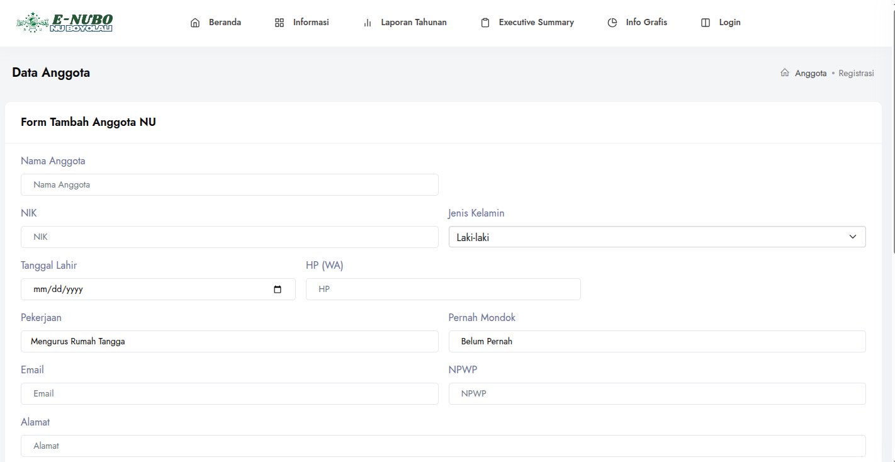

# Enubo Form Automation Bot

Bot ini digunakan untuk **mengisi form pendaftaran keanggotaan NU Boyolali** secara otomatis dari file Excel. Bot dibuat menggunakan Python + Selenium, dan mendukung pemrosesan massal data dengan hasil log.



---

## ✨ Fitur

- Headless (otomatis tanpa membuka browser)
- Otomatis isi semua field dari Excel
- Memilih kelurahan berdasarkan kode yang valid
- Konversi tanggal otomatis (menghindari error `Invalid datetime format`)
- Logging ke file `log_submit.txt`

---

## 🛠️ Kebutuhan Sistem

- Python 3.8+
- Google Chrome + ChromeDriver (versi sama)
- Paket Python:
  - `selenium`
  - `pandas`
  - `openpyxl`

---

## 📦 Instalasi

1. **Clone/download repo** dan pindah ke folder proyek:
   ```bash
   cd nama-folder-proyek
   ```

2. **Install dependensi**:
   ```bash
   pip install -r requirements.txt
   ```

3. **Siapkan file Excel**
   - Nama file: `anggota.xlsx`
   - Letakkan di direktori yang sama
   - Format kolom sesuai contoh:
     - `nama_muzaki`, `nik`, `tgl_register`, `jenis_kelamin`, `hp`, `alamat`, `kelurahan`, `rt`, `rw`, `pekerjaan`, `mondok`, `email`, `npwp`, `dinas`, `keanggotaan`, `bersedia`, `keterangan`

---

## 🚀 Cara Menjalankan

```bash
python3 submit_anggota.py
```

Bot akan:
- Membaca semua baris dari `anggota.xlsx`
- Mengisi form pendaftaran: https://enubo.nuboyolali.or.id/keanggotaan/daftar/N
- Mencatat keberhasilan/gagal ke terminal & `log_submit.txt`

---

## 📝 Format Tanggal di Excel

- Disarankan format Excel kolom `tgl_register` adalah **Tipe Tanggal**
- Format yang didukung:
  - `15/05/1998`
  - `1998-05-15`
  - Serial Excel (`35925`)

Bot akan otomatis mengonversi ke `YYYY-MM-DD`.

---

## 📁 Log

Setiap hasil input akan disimpan ke file:

```
log_submit.txt
```

Berisi:
- ✅ Baris yang sukses
- ❌ Baris yang gagal + alasannya

---

## 🧩 Catatan Tambahan

- `kecamatan` otomatis diset ke **Tamansari (9471041)**
- `kelurahan` dipilih dari mapping berdasarkan nama → value
- Tidak mengupload gambar

---

## 📄 License

Proyek ini bebas digunakan untuk internal NU Boyolali. Silakan modifikasi sesuai kebutuhan.
